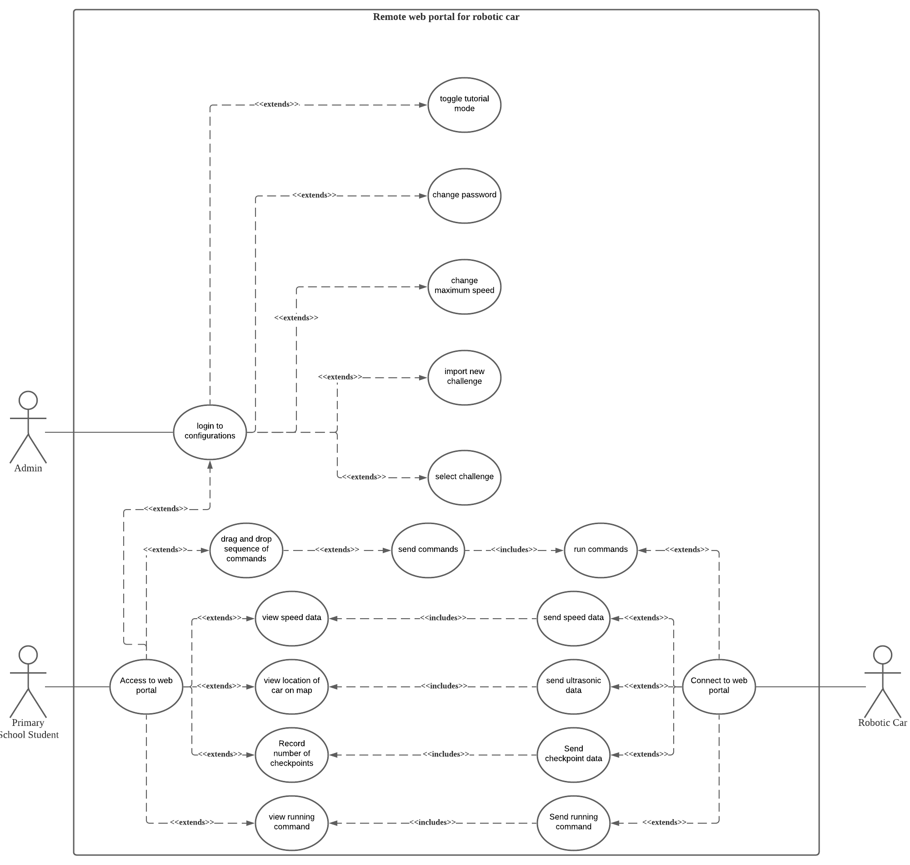
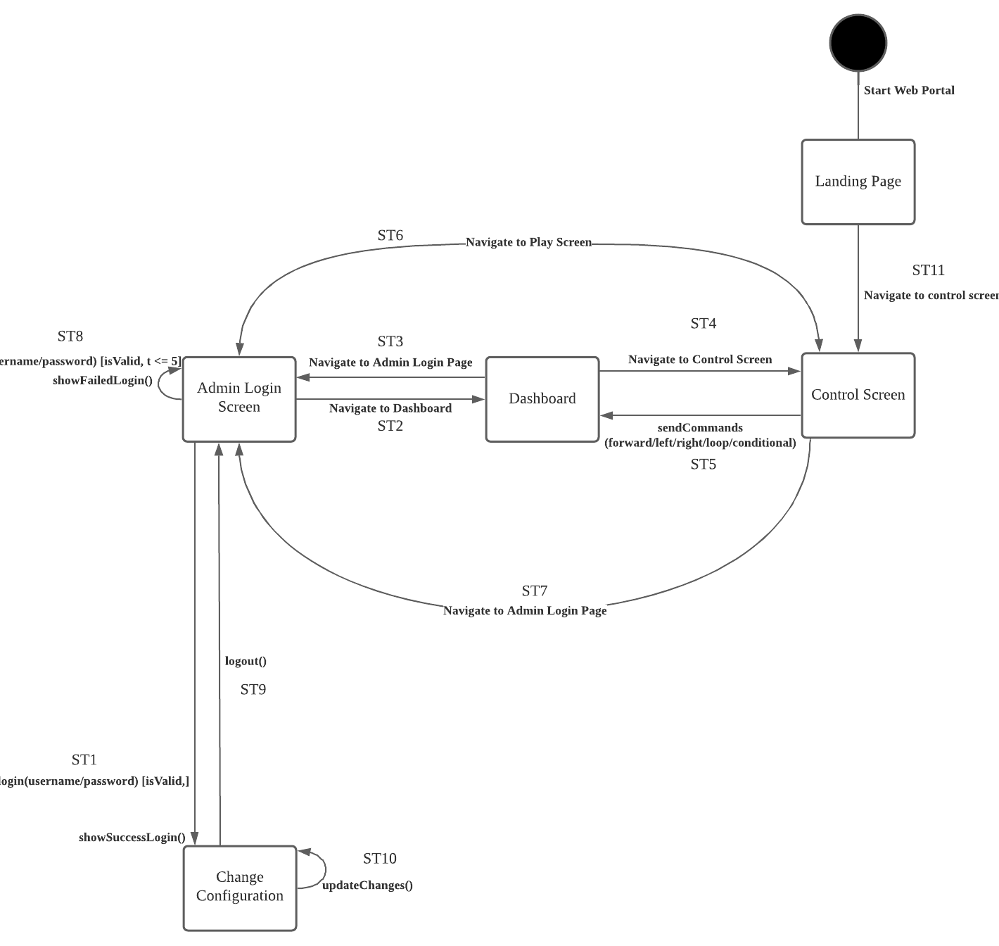

<div id="top"></div>
<!-- PROJECT LOGO r-->
<br />
<div align="center">
  <a href="https://github.com/github_username/repo_name">
    
  </a>

<h3 align="center">CRUSH GEAR</h3>

  <p align="center">
    ICT2x01-P1-10 Project
    <br />
    <a href="https://github.com/github_username/repo_name"><strong>Explore the docs »</strong></a>
    <br />
    <br />
    <a href="https://github.com/github_username/repo_name">View Demo</a>
    ·
    <a href="https://github.com/github_username/repo_name/issues">Report Bug</a>
    ·
    <a href="https://github.com/github_username/repo_name/issues">Request Feature</a>
  </p>
</div>

<!-- How to run-->
## Introduction 
Crush Gear 2000 is a fun and interactive game where users can remotely connect and control the car using web portal. Users will have to navigate the car through an obstacle course. This project will be targeted at primary school students, which will encourage their problem-solving and critical-thinking skills.
Other than the game, users will be able view sensor data from the car through the web portal. This allows users to see and understand what the car is sensing and how it is reacting. This will be beneficial for troubleshooting their navigation and gaining a better understanding on how a robot works.
## WorkFlow 
***Branch description*** 

*Master Branch:*
The master branch will be storing the final functioning codes. All developer’s work will be meagered together. 

*Development branch:*
Development branch consists of codes that may not be properly functioning. It may be unstable and crashes. 


*Features branches:* Team members created different features branch from and merged it to development branch after completion. Before making changes on feature branches, members pulled changes to ensure all features branches are up to date. 

**Below is the mock-up of the team's workflow :**


## How to Run
*To run at a virtual enviroment* 
1) Open a terminal 
2) python3 -m venv venv 
3) .ven/bin/active 
4) pip install Flask 
5) python portal.py 


### Dependencies
Flask

Python-Dotenv

Python-Decouple

### Installation

```
pip install -r requirements.txt
```

### Execution
Both portal and car need to be connected to the same mobile hotspot. A .env file also needs to be created with a username and password hashed with SHA256 to faciliate admin login

1. Power up the car
2. Run portal.py
4. Car should be connected within 30 seconds
5. Access website: http://127.0.0.1:5000
6. Code and start the car!

<p align="right">(<a href="#top">back to top</a>)</p>

<!-- development workflow -->
## Development Workflow

<!-- UAT -->
## UAT

### Use Case Diagram
<div align='center'>

</div>

### System State Diagram
<div align='center'>

</div>

For the system state diagram, the end screen has been removed and replaced with a landing page that has a tutorial video. The end screen is removed because coding requires a lot of testing, and an end screen is disruptive for the process. Users can instead see their score on the dashboard.


<p align="right">(<a href="#top">back to top</a>)</p>

<!-- whitebox testing -->
## Whitebox Testing

### Admin Authentication - Test Case


https://user-images.githubusercontent.com/19475364/144821629-be00601c-c1ff-4526-9c3c-f18b26cd86c6.mp4


The video above shows all the test cases for admin authentication. In total, there are 14 test cases that was being run. We use the built in unit testing framework that python has provided.

The list of test cases includes:
* testEmptyPass
* testEmptyUser
* testBan
* testBadCreds
* testUnBan
* testLogin
* testEmptyNewPass
* testEmptyConfNewPass
* testEmptyOldPass
* testWrongOldPass
* testSamePass
* testDiffPass
* testPol
* testChange

### Coverage Statistic

#### Login


Total statement = 16

testUnBan = 3/16

testEmptyUser = 2/16

testEmptyPass = 2/16

testLogin = 3/16

testBadCreds = 3/16

testBan = 3/16

#### Change Password


Total statement = 19

testSamePass = 2/19

testEmptyNewPass = 2/19

testEmptyConfNewPass = 2/19

testEmptyOldPass = 2/19

testWrongOldPass = 2/19

testDiffPass = 2/19

testPol =  2/19

testChange = 5/19


## Members

Ng Jing Yong - 2002478@sit.singaporetech.edu.sg

Ng Jing Fang - 2002855@sit.singaporetech.edu.sg

Mohamad Lutfee - 2001369@sit.singaporetech.edu.sg

Seah Yuan Shengh - 2000532@sit.singaporetech.edu.sg

Yang Yuqin - 2002620@sit.singaporetech.edu.sg

<p align="right">(<a href="#top">back to top</a>)</p>


<!-- ACKNOWLEDGMENTS -->
## Acknowledgments

* []()
* []()
* []()

<p align="right">(<a href="#top">back to top</a>)</p>


<!-- MARKDOWN LINKS & IMAGES -->
<!-- https://www.markdownguide.org/basic-syntax/#reference-style-links -->
[contributors-shield]: https://img.shields.io/github/contributors/github_username/repo_name.svg?style=for-the-badge
[contributors-url]: https://github.com/github_username/repo_name/graphs/contributors
[forks-shield]: https://img.shields.io/github/forks/github_username/repo_name.svg?style=for-the-badge
[forks-url]: https://github.com/github_username/repo_name/network/members
[stars-shield]: https://img.shields.io/github/stars/github_username/repo_name.svg?style=for-the-badge
[stars-url]: https://github.com/github_username/repo_name/stargazers
[issues-shield]: https://img.shields.io/github/issues/github_username/repo_name.svg?style=for-the-badge
[issues-url]: https://github.com/github_username/repo_name/issues
[license-shield]: https://img.shields.io/github/license/github_username/repo_name.svg?style=for-the-badge
[license-url]: https://github.com/github_username/repo_name/blob/master/LICENSE.txt
[linkedin-shield]: https://img.shields.io/badge/-LinkedIn-black.svg?style=for-the-badge&logo=linkedin&colorB=555
[linkedin-url]: https://linkedin.com/in/linkedin_username
[product-screenshot]: images/screenshot.png
